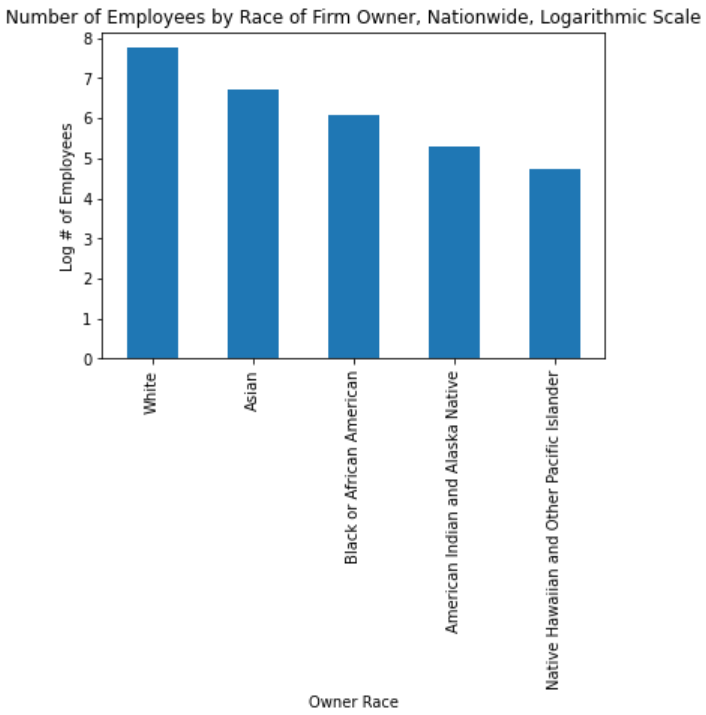
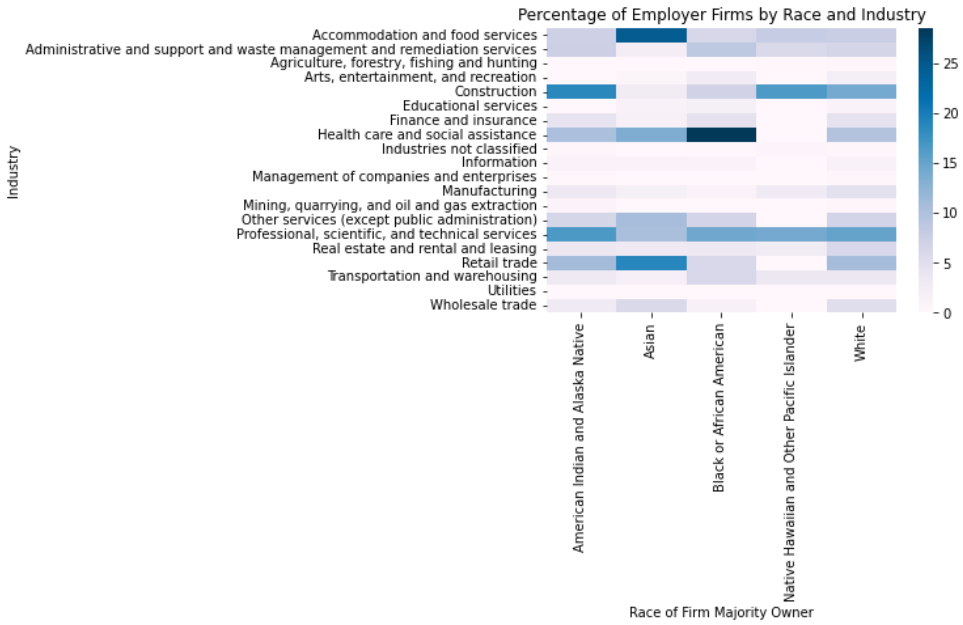

**Exploratory Visualizations of US Census American Business Survey (ABS) Data**     

This project uses data taken from the ABS, specifically the Company Survey data, to investigate the relationship between firm ownership, industry classification and race.     

**Question 1: How Does Ownership of Firms Vary by Race?**

     
**Question 2: Is Industry Classification Independet of Owner Race**

This is visual is kind deceptively complicated. Every cell is a percentage, and all the percentages in a column sum to 100%. The sum across rows, however, is meaningless. Ideally this would be some kind of grouped bar graph, but they all wound up being too cumbersome