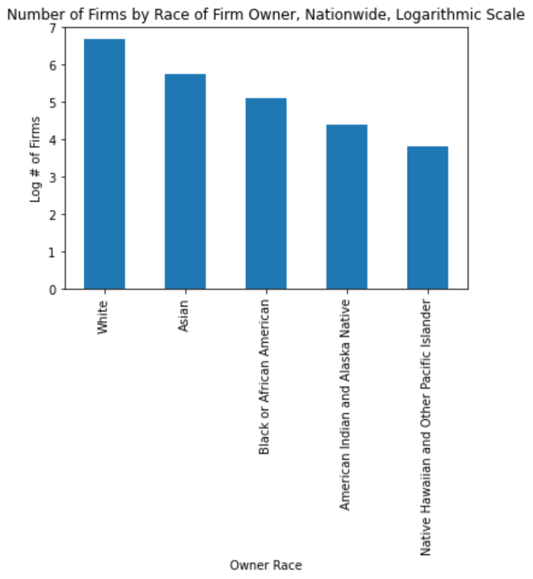
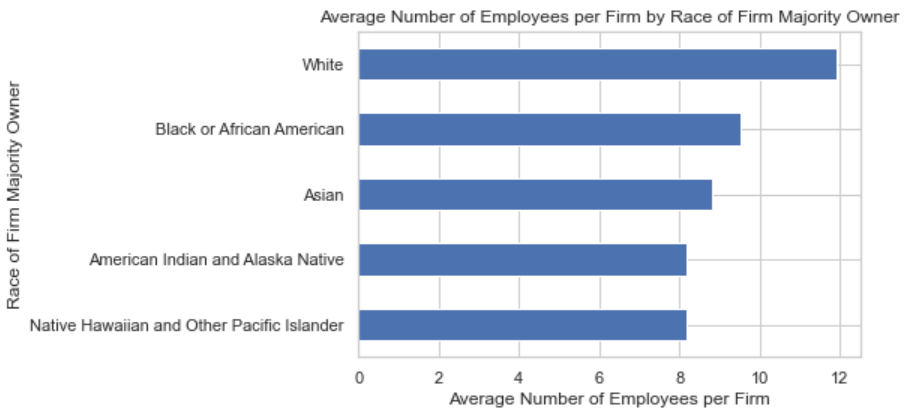

**Exploratory Visualizations of US Census Annual Business Survey (ABS) Data**     

This project uses data taken from the ABS, specifically the Company Survey data, to investigate the relationship between firm ownership, industry classification and race.     

**Question 1: How Does Ownership of Firms Vary by Race?**

     
**Question 2: Does the Average Number of Employees per Firm Vary By Race?**

     

**Question 2: Is Industry Classification Independent of Owner Race**

This is visual is deceptively complicated. Every cell is a percentage, and all the percentages in a column sum to 100%. The sum across rows, however, is meaningless. Interested in finding other ways to visualize this data.